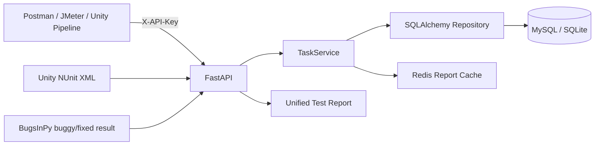

# 系统架构

```mermaid
flowchart LR
    Client[Postman / JMeter / Unity Pipeline] -->|X-API-Key| API[FastAPI]
    API --> Service[TaskService]
    Service --> Repository[SQLAlchemy Repository]
    Repository --> MySQL[(MySQL / SQLite)]
    Service --> Cache[Redis Report Cache]
    Unity[Unity NUnit XML] --> API
    Bugs[BugsInPy buggy/fixed result] --> API
    API --> Report[Unified Test Report]
```

服务层不依赖具体数据库实现；Repository 负责持久化，Redis 仅用于报告缓存。
缓存异常时服务继续从数据库组装报告。Unity 和 BugsInPy 都作为外部测试结果
适配器接入同一任务报告。
